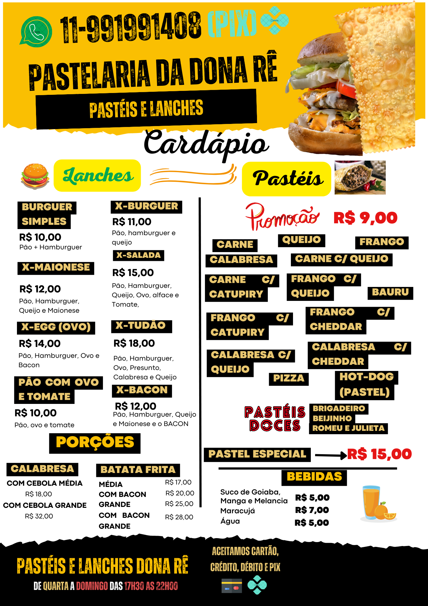
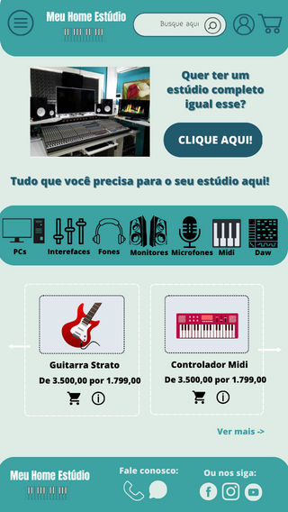
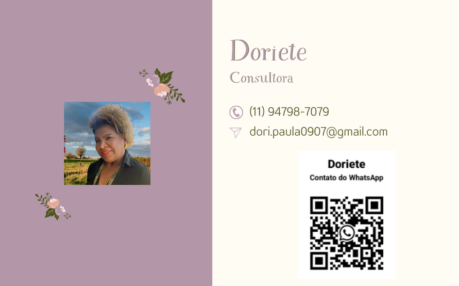
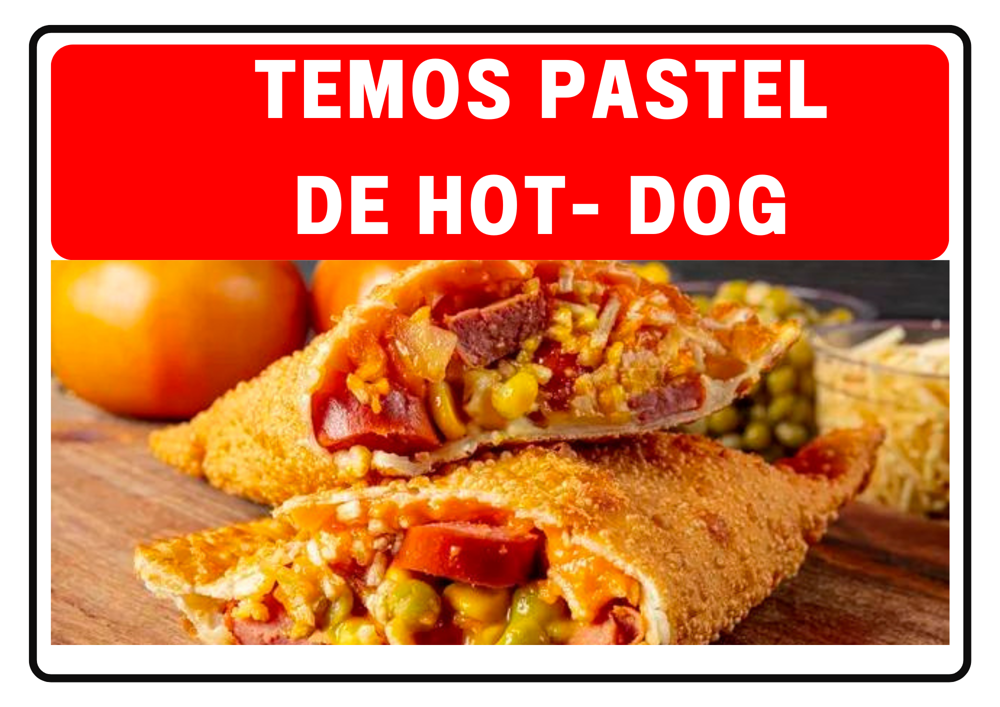
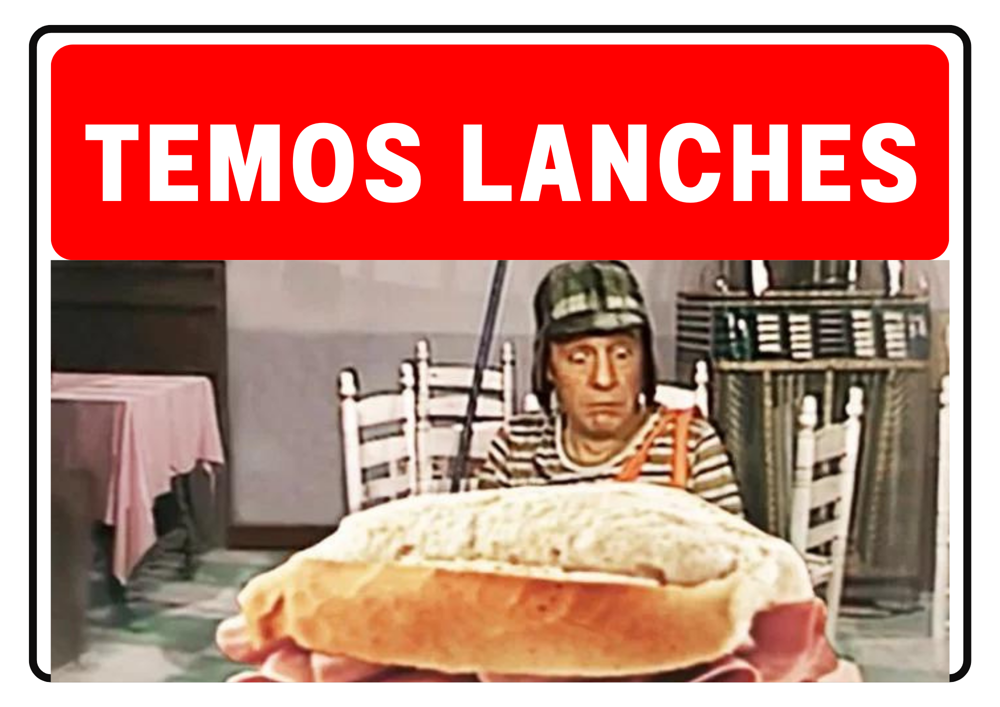

# 1. Modelos de Design Criado por mim para alguns clientes

## Modelo de cardápio

## Modelo de Prototipagem de Site Mobile

## Modelos de cartões de consultoria

#### Exemplo, modelo 1

#### Exemplo, modelo 2

#### Exemplo, modelo 3

#### Exemplo 4 

## Modelos de Folders Para Clientes

#### Exemplo 1

#### Exemplo 2

#### Exemplo 3 😁

## 2.2 Considerações Finais

Em meus trabalhos desenvolvidos, sempre busco manter uma relação mútua de cumplicidade com o meu cliente para que ele possa se sentir à vontade, para assim poder passar suas dores, para que eu possa entender melhor o seu negócio, a sua necessidade, para assim entregar em meus trabalhos, um conteúdo de valor.

Para que assim, agregue ao seu negócio, entregas de valor, sempre buscando ajudar o máximo possível cada cliente que ÚNICO, independente se é um negócio voltado para um público local, da microrregião, ou seja ele um grande empresário.

