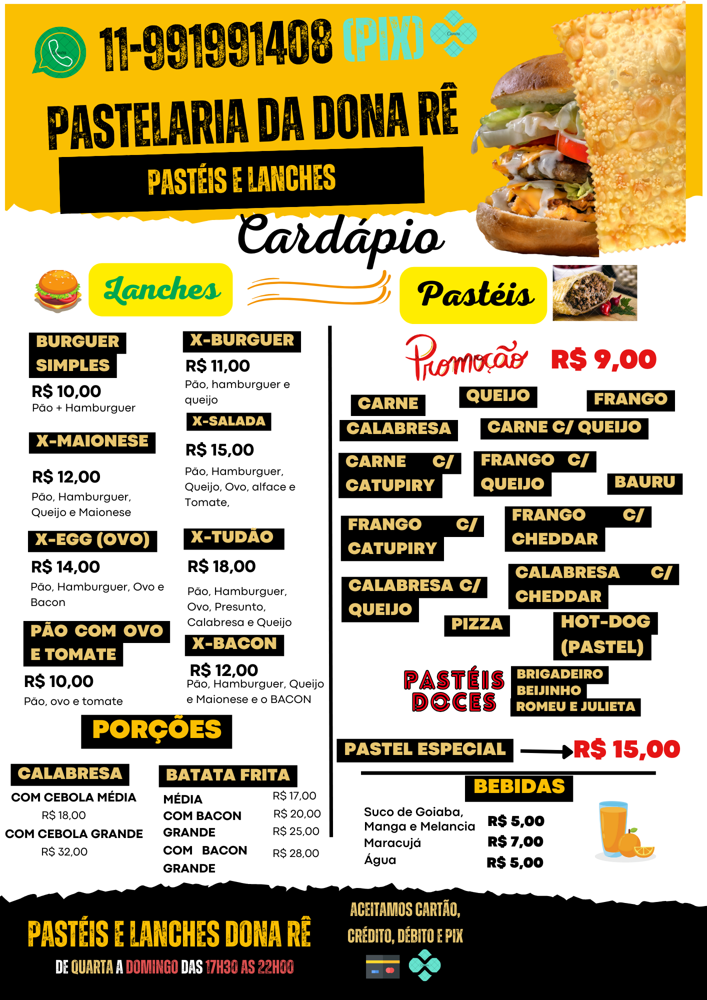
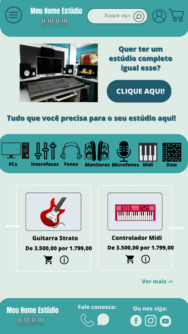
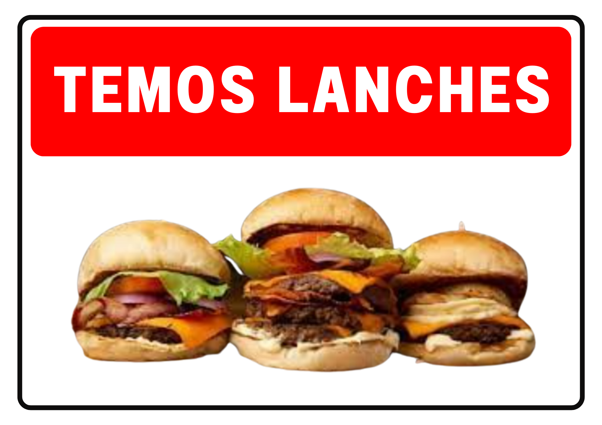

# 1. Modelos de Design Criado por mim para alguns clientes

## Modelo de card√°pio

## Modelo de Prototipagem de Site Mobile

## Modelos de cartões de consultoria

#### Exemplo, modelo 1

#### Exemplo, modelo 2

#### Exemplo, modelo 3

#### Exemplo 4 

## Modelos de Folders Para Clientes

#### Exemplo 1

#### Exemplo 2

#### Exemplo 3 üòÅ

## 2.2 Considerações Finais

Em meus trabalhos, sempre busco estabelecer uma relação mútua de cumplicidade com o o cliente, para que ele possa sentir-se à vontade, assim passando naturalmente suas dores, suas dificuldades, seus problemas do dia a dia da sua empresa. Para que desta maneira, eu possa entender melhor a respeito do seu negócio, para que consequentemente possa entregar um conteúdo que agregue à ele mais valor. Assim consigo atender todos os tipos de negócios, desde ao micro empresario indidual ao negócio de grande porte.
.

    "O reflexo de um bom atendimento é o carinho de um cliente satisfeito."
    Óticas Carol Vila Isabel

    Retirado desse site https://www.pensador.com/atendimento_ao_cliente/ em 24/09/2023.

